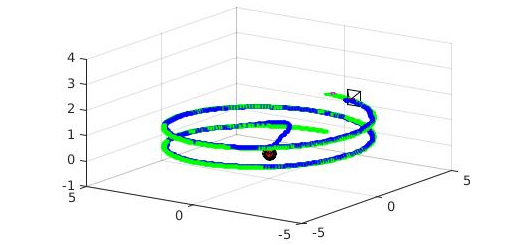
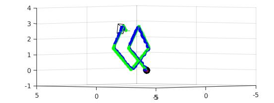

## ELEC5660 Introduction to Aerial Robotics: Project 1 Phase 1

In this project, you are provided with a quadrotor simulator written in Matlab.
The simulator implements dynamics model of quadrotor and relies on the numerical solver ode45. Your tasks include:

### Controller
You will need to implement controller in [controller.m](/L3-%20Control%20Basics%20Quadrotor%20Control/proj1phase1/code/controller.m). The input of controller includes time `t`, current
state vector `s` and desired state vector `s_des`. The output of controller is force `F` and moment `M`. Detailed derivation
can be found in lecture notes and [1].

### Trajectories
You will need to command the quadrotor through three sample trajectories: hovering, circle and diamond. All
trajectory generators take time `t` and current state vector `s` as input and output desired state vector `s_des`. The
duration of all trajectories should be 25 s. At least one circulation (for the last 2 trajectories) should be included.
Besides, along the trajectory, the yaw angle of the quadrotor must be changing smoothly. Note: Be careful about the
discontinuous point of the Euler angle, such as -180&deg; to 180&deg;.


- [hover trajectory.m](/L3-%20Control%20Basics%20Quadrotor%20Control/proj1phase1/code/hover_trajectory.m): Hover at (0, 0, 0), the simplest motion. A sample code is given.

- [circle trajectory.m](/L3-%20Control%20Basics%20Quadrotor%20Control/proj1phase1/code/circle_trajectory.m): A helix in the xy plane of radius 4 m centered about the point (0, 0, 0). The z
coordinate should start at 0 and end at 3. The quadrotor should start at the point (0, 0, 0).

- [diamond trajectory.m](/L3-%20Control%20Basics%20Quadrotor%20Control/proj1phase1/code/diamond_trajectory.m): A “diamond helix” with corners at (0, 0, 0), (0, 2 sin 45&deg; , 2 cos 45&deg; ), (0, 0, 4 cos 45&deg; ),
and (0, −2 sin 45&deg; , 2 cos 45&deg; ) when projected into the yz plane, and x coordinate starting at 0 and ending at 4.
The quadrotor should start at (0, 0, 0).

Sample trajectories are shown below. Sample codes for generating such trajectories have been provided, you can directly use them. Or you can write your own trajectories, but the above requirements for the trajectories must be satisfied.

<p align="center">
  
  
</p>

### Sturcture of the Simulator

Use the script [test_trajectory.m](/L3-%20Control%20Basics%20Quadrotor%20Control/proj1phase1/code/test_trajectory.m) as the main entry point.

```bash
+ code
  + readonly #supposed to be read only
    - quadModel_readonly.m #parameters of a 500g quadrotor
    - quadEOM_readonly.m #dynamics model of quadrotor.
    - run_trajectory_readonly.m #solve the equation of motion, receive desired trajectory,run your controller, iteratively. visualization is also included.
  + utils #useful functions.
  - controller.m #what you need to work with. Calculate force and moment given current and desired state vector of quadrotor.
  - *_trajectory.m #what you need to work with. design the trajectory for quadrotor given the path. Calculate desired state given current state vector and current time. The file trajectory_generator gives a framework just for reference.
  - test_trajectory.m #main entry.
```

[1]: N. M, M. Daniel, L. Quentin, and K. Vijay, “The grasp multiple micro-uav testbed,” IEEE Robotics and Automation Magazine, vol. 17, no. 3, pp. 56–65, 2010.
